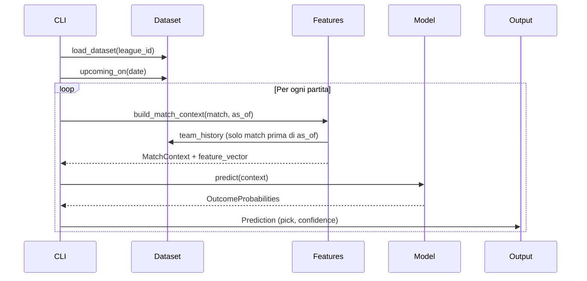

# Architettura del motore previsionale

## Obiettivo del sistema

Produzione di probabilità **esclusivamente** per il mercato **1/X/2**:

- **P(1)** — vittoria casa
- **P(X)** — pareggio
- **P(2)** — vittoria trasferta

Da queste derivano **pick** (esito più probabile) e **confidenza** (`max(P(1), P(X), P(2))`).

Il motore è **proprietario**: non usa l'add-on Predictions di Sportmonks.

---

## Vista a strati

```
┌─────────────────────────────────────────────────────────────┐
│                         CLI (src/cli.py)                     │
│              sync | predict | backtest                       │
└──────────────────────────┬──────────────────────────────────┘
                           │
┌──────────────────────────▼──────────────────────────────────┐
│                    PREDICTION LAYER                          │
│   predict_match.py → predict_round.py → explain.py           │
└──────────────────────────┬──────────────────────────────────┘
                           │
┌──────────────────────────▼──────────────────────────────────┐
│                      MODEL LAYER                             │
│   registry → poisson | dixon_coles | elo | feature           │
│              → ensemble → calibration                        │
└──────────────────────────┬──────────────────────────────────┘
                           │
┌──────────────────────────▼──────────────────────────────────┐
│                   FEATURE LAYER                              │
│   match_context ← recent_form, team_strength, standings,     │
│                   home_away, xg, lineup, tactical            │
└──────────────────────────┬──────────────────────────────────┘
                           │
┌──────────────────────────▼──────────────────────────────────┐
│                   DATA PIPELINE                              │
│   sync → normalize → dataset_builder                         │
└──────────────────────────┬──────────────────────────────────┘
                           │
         ┌─────────────────┴─────────────────┐
         │                                   │
┌────────▼────────┐               ┌──────────▼──────────┐
│  OFFLINE (F2)   │               │  SPORTMONKS (F3)    │
│ tests/fixtures  │               │ client + cache      │
│ data/processed  │               │ API v3 Football     │
└─────────────────┘               └─────────────────────┘
```

---

## Flusso predizione (logica)



### Regola anti-leakage

Per ogni partita, `as_of = match.starting_at`. Tutte le feature usano **solo** partite con `starting_at < as_of`. Questo vale anche nel backtesting.

---

## Collegamenti tra moduli

### `src/config.py`

Centro configurazione: legge `.env`, espone `Settings`. Controlla:

- `is_offline` — se usare fixture locali
- `can_sync_api` — se abilitare Fase 3 (`ENABLE_SPORTMONKS_SYNC=true` + token)

### `src/domain/`

Entità pure del calcio, indipendenti da Sportmonks:

| Classe | Ruolo |
|--------|-------|
| `Match` | Partita con partecipanti, score, datetime |
| `Team`, `Player` | Anagrafica |
| `OutcomeProbabilities` | P(1), P(X), P(2) normalizzate |
| `Prediction` | Output finale con pick e confidenza |

### `src/sportmonks/`

Adattatore verso API esterna (Fase 3). Oggi usato solo se `can_sync_api=True`.

| Modulo | Endpoint documentato |
|--------|---------------------|
| `client.py` | HTTP + `Authorization` header |
| `cache.py` | SQLite response cache |
| `fixtures.py` | `/fixtures/date`, `/fixtures/between` |
| `leagues.py` | `/leagues/{id}` + currentSeason |
| `standings.py` | `/standings/seasons/{id}` (predisposto) |

Moduli scheletro per Fase 3: `players`, `lineups`, `injuries`, `statistics`.

### `src/data_pipeline/`

| Modulo | Funzione |
|--------|----------|
| `normalize.py` | JSON Sportmonks → `Match` |
| `dataset_builder.py` | `MatchDataset` con query temporali |
| `sync.py` | Carica offline o API, salva in `data/processed/` |

### `src/features/`

Trasformano storico partite in numeri per i modelli.

| Modulo | Output |
|--------|--------|
| `recent_form.py` | Gol fatti/subiti ultimi N match |
| `team_strength.py` | Attack/defense normalizzati |
| `standings_features.py` | Classifica calcolata da risultati |
| `home_away.py` | Giorni riposo, congestione |
| `xg_features.py` | xG da fixture mock (Fase 3: API) |
| `lineup_features.py` | Qualità lineup e duelli tattici |
| `match_context.py` | Aggrega tutto in `feature_vector` |

### `src/models/`

Tutti implementano `BaseModel.predict(context) → OutcomeProbabilities`.

| Modello | Logica |
|---------|--------|
| `poisson` | λ casa/trasferta da strength → matrice score |
| `dixon_coles` | Poisson + correzione τ su 0-0, 1-0, 0-1, 1-1 |
| `elo` | Rating dinamico → probabilità esito |
| `feature` | Softmax lineare su feature_vector |
| `ensemble` | Media pesata + temperature scaling |

`registry.py` costruisce la lista modelli e l'ensemble.

### `src/prediction/`

| Modulo | Funzione |
|--------|----------|
| `predict_match.py` | Singola partita → `Prediction` |
| `predict_round.py` | Lista partite + export JSON |
| `explain.py` | Breakdown feature per trasparenza |

### `src/backtesting/`

| Modulo | Funzione |
|--------|----------|
| `backtest.py` | Loop partite finite, no leakage |
| `metrics.py` | Accuracy, Brier, log-loss, calibration bins |
| `reports.py` | Confronto multi-modello JSON |

---

## Decisioni architetturali

1. **Separazione layer** — Il dominio calcistico non dipende da Sportmonks; l'API è un adapter.
2. **Offline-first** — Sviluppo e test senza token; API opzionale in Fase 3.
3. **Multi-modello** — Ogni modello produce 1/X/2; l'ensemble combina.
4. **Feature vector condiviso** — Il FeatureModel e l'explain usano lo stesso vettore.
5. **Documentazione locale Sportmonks** — Cursor e sviluppatori consultano `docs/sportmonks-football-v3-docs.md`.

---

## Struttura file dati

```
data/
  processed/          # Dataset normalizzato (generato da sync)
  predictions/        # Output predizioni JSON
  backtests/          # Report backtest JSON/CSV
  cache.db            # Cache API (Fase 3)
  raw/                # Riservato sync grezzo (Fase 3)

tests/fixtures/
  league_384_matches.json
  league_384_xg.json
  league_384_lineups.json
```

---

## Vincoli di progetto

- Auth Sportmonks: header `Authorization` only
- Output: solo 1/X/2
- Endpoint/campi: solo da documentazione locale
- No add-on Predictions Sportmonks
