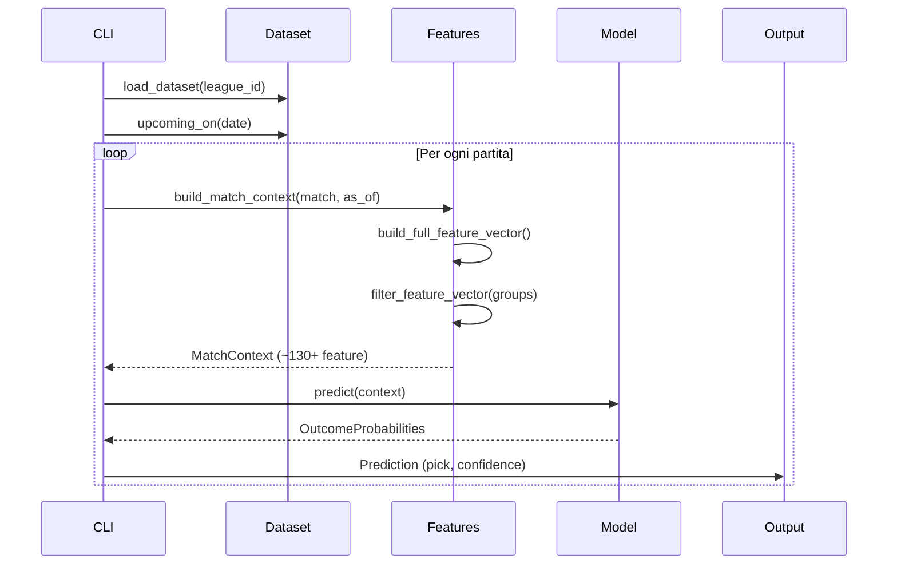

# Architettura del motore previsionale

## Obiettivo del sistema

Produzione di probabilità **esclusivamente** per il mercato **1/X/2**:

- **P(1)** — vittoria casa
- **P(X)** — pareggio
- **P(2)** — vittoria trasferta

Da queste derivano **pick** (esito più probabile) e **confidenza** (`max(P(1), P(X), P(2))`).

Il motore è **proprietario**: non usa l'add-on Predictions di Sportmonks.

---

## Vista a strati

```
┌─────────────────────────────────────────────────────────────┐
│                         CLI (src/cli.py)                     │
│     sync | predict | backtest | features | ablation | status | validate | walk-forward │
└──────────────────────────┬──────────────────────────────────┘
                           │
┌──────────────────────────▼──────────────────────────────────┐
│                    PREDICTION LAYER                          │
│   predict_match.py → predict_round.py → explain.py           │
└──────────────────────────┬──────────────────────────────────┘
                           │
┌──────────────────────────▼──────────────────────────────────┐
│                      MODEL LAYER                             │
│   registry → poisson | dixon_coles | elo | feature           │
│              → ensemble → calibration                        │
└──────────────────────────┬──────────────────────────────────┘
                           │
┌──────────────────────────▼──────────────────────────────────┐
│                   FEATURE LAYER (9 gruppi)                   │
│   match_context ← feature_vector ← feature_groups            │
│   advanced_strength | xg | shots | sos | lineup | tactical │
│   fatigue | motivation | form | standings | team_strength    │
└──────────────────────────┬──────────────────────────────────┘
                           │
┌──────────────────────────▼──────────────────────────────────┐
│              DATA QUALITY LAYER (Fase 2e)                      │
│   checks.py | report.py — validate dataset + companion        │
└──────────────────────────┬──────────────────────────────────┘
                           │
┌──────────────────────────▼──────────────────────────────────┐
│              EVALUATION LAYER                                  │
│   backtest.py | walk_forward.py | ablation.py | metrics.py    │
└──────────────────────────┬──────────────────────────────────┘
                           │
┌──────────────────────────▼──────────────────────────────────┐
│                   DATA PIPELINE                              │
│   sync → normalize → dataset_builder                         │
└──────────────────────────┬──────────────────────────────────┘
                           │
         ┌─────────────────┴─────────────────┐
         │                                   │
┌────────▼────────┐               ┌──────────▼──────────┐
│  OFFLINE (F2)   │               │  SPORTMONKS (F3)    │
│ tests/fixtures  │               │ client + cache      │
│ data/processed  │               │ API v3 Football     │
└─────────────────┘               └─────────────────────┘
```

---

## Flusso predizione



### Regola anti-leakage

Per ogni partita, `as_of = match.starting_at`. Tutte le feature storiche usano **solo** partite con `starting_at < as_of`. Vale per backtest e ablation.

Lineup e tactical aggiuntivi:
- Partite **finite**: solo righe con `data_availability = known_pre_match`
- Partite **future**: solo righe con `data_availability = forecast`
- Validazione `home_id` / `away_id` contro i partecipanti reali del match
- Fallback neutro se dati non disponibili (`default_fallback`)

---

## Gruppi feature (`feature_groups.py`)

| Gruppo | Modulo | ~Feature |
|--------|--------|----------|
| `base` | form, standings, team_strength, home_away | 20 |
| `advanced_strength` | `advanced_strength.py` | 16 |
| `xg` | `xg_features.py` | 20 |
| `shots` | `shots_features.py` | 18 |
| `strength_of_schedule` | `schedule_strength.py` | 8 |
| `player_lineup` | `lineup_features.py` | 20 |
| `tactical` | `tactical_features.py` | 8 |
| `calendar` | `fatigue_features.py` | 13 |
| `motivation` | `motivation_features.py` | 14 |

Assemblaggio in `feature_vector.py`, orchestrazione in `match_context.py`.

---

## Ablation framework

```
ABLATION_VARIANTS (cumulative):
  base → base+xg → base+shots → base+player_lineup
       → base+tactical → base+calendar → full
```

- Engine: `src/backtesting/ablation.py`
- Modello valutato: `FeatureModel` con `enabled_groups`
- Output: `data/backtests/ablation_*.json`

---

## Collegamenti tra moduli

### `src/features/`

| Modulo | Ruolo |
|--------|-------|
| `match_context.py` | Aggregatore centrale, `build_match_context()` |
| `feature_vector.py` | Costruisce vettore completo |
| `feature_groups.py` | Definizione gruppi + filtri ablation |
| `advanced_strength.py` | Rating attacco/difesa, rolling, opponent-adjusted |
| `xg_features.py` | xG rolling, overperformance, split H/A |
| `shots_features.py` | Volume tiri, conversione, big chances |
| `schedule_strength.py` | SOS, points vs expected |
| `lineup_features.py` | XI ratings, assenze, gate pre-match, `resolve_lineup_for_match()` |
| `tactical_features.py` | Formazioni, duelli tattici, gate pre-match |
| `data_sources.py` | Tracciamento origine dati per gruppi feature (explain/status) |
| `fatigue_features.py` | Riposo, midweek, fatigue score |
| `motivation_features.py` | Pressione classifica (top4, retrocessione) |
| `recent_form.py`, `team_strength.py`, `standings_features.py`, `home_away.py` | Feature base |

### `src/backtesting/`

| Modulo | Funzione |
|--------|----------|
| `backtest.py` | Walk-forward multi-modello |
| `ablation.py` | Studio incrementale gruppi feature |
| `metrics.py` | Accuracy, Brier, log-loss, Brier skill, pick over/underconf, mean_calibration_gap |
| `reports.py` | Report JSON/CSV comparativi |

### `src/prediction/explain.py`

Explain arricchito: probabilità, contributi modelli, edge (xG, strength, lineup, tactical, fatigue), fattori positivi/negativi, `data_sources`, warning confidenza e fallback.

**Diagnostica:** `src/cli_status.py` — comando `status` per ispezione dataset offline.

---

## Struttura file dati

```
data/
  processed/          # Dataset normalizzato
  predictions/        # Predizioni JSON
  backtests/          # Backtest + ablation JSON
  cache.db            # Cache API (Fase 3)

tests/fixtures/
  league_384_matches.json     # 50 partite (40 finite + 10 future)
  league_384_xg.json          # xG team + match_history
  league_384_shots.json       # Shot profile + match_history
  league_384_lineups.json     # Lineup + player impact
  league_384_tactical.json    # Matchup tattici
  league_384_calendar.json    # Midweek, rotation risk

scripts/
  generate_fixtures.py          # Rigenera fixture mock
  fetch_sportmonks_docs.py    # Docs API offline
```

---

## CI/CD

GitHub Actions (`.github/workflows/ci.yml`): `pytest` su ogni push/PR su `main`.

---

## Vincoli di progetto

- Auth Sportmonks: header `Authorization` only
- Output: solo 1/X/2
- Endpoint/campi: solo da documentazione locale
- No add-on Predictions Sportmonks
- Feature aggiunte solo se testabili con ablation
